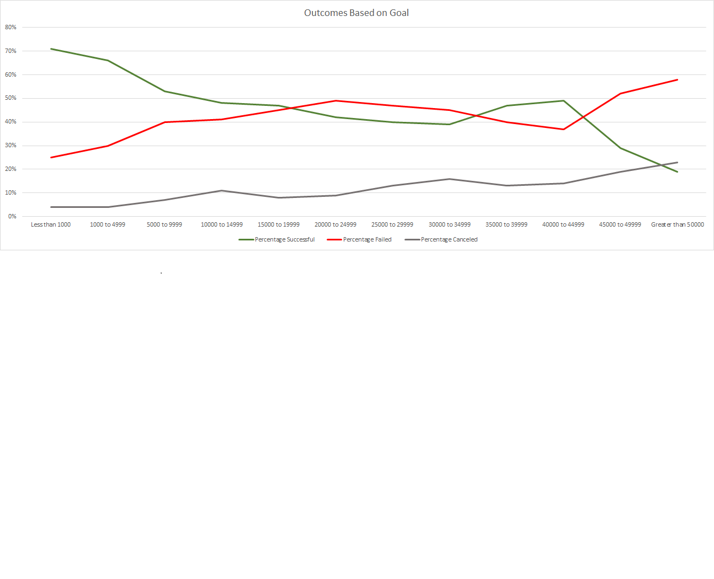
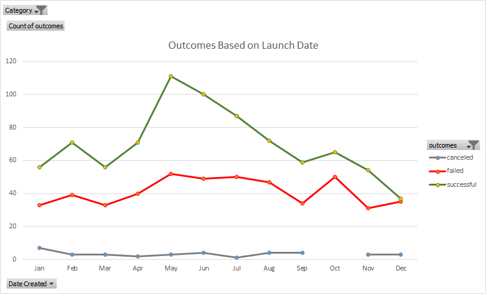

# An Analysis of Kickstarter Campaigns

##
Performing Analysis on Kickstarter data to see trends.
This project helpe to learn Excel skills.

###Challenge Module 1
Analize Kickstart Data to determine if length of campaign contributes to the success or failure of a project.

Outcomes Based on Goals - This graph displays how many campaigns were successful, failed or canceled basedd on the fund raising goal of the project.

Outcomes Based on Launch Date - This graph displays how many campaigns were successful, failed or canceled based on the date the project started.

Conclusion: From looking at the Outcomes Based on Goal chart, the biggest gap in success versus failure are in projects from $1000-$4999, after the goal amount gets larger, the level of failure increases and the level of success decreases.  Failures seem consistent from the point of view of this chart, only slightly increasing as the goal amount gets larger.  From the Outcomes Based on Launch Date chart, failures seem inevitable, no matter the launch date.  However, the most successful campaigns started in May.

Suggestions: This data set only represents a one-dimensional view of crowdfunding projects.  I would say this data alone is not enough to analyze to be able to make a complete recommendation.  I would suggest gathering data about why projects got cancelled and at what point in funding where they cancelled.  In addition, tracking how funded the project was during its lifecycle and what was done when that funding was dipping.  It would also be helpful to know how the crowdfunding campaigns were marketed.  For example, did they use videos, social media sites, blog posts, etc?  This combined data can tell if the initial project could be successful and to keep it that way.  
